class: center, middle, no-number, titlepage
count: false

# Multi-task Learning for Aspect-level Sentiment Analysis

.author[Wen Weihuang]

.date[March 08, 2018]

---

# What is sentiment analysis?

Todo

---

# What is aspect-level sentiment analysis?

Todo

---

# What is multi-task learning

Todo

---

# How? Recent Work on Interpretability

## Detailed (in this slides)

- Influence functions
- Information bottleneck

## Computer Vision Perspective

- Network dissection
- Interpretable CNNs
- Visualization
- ...

## Others

LIME, rule extraction, testing of DL systems, XAI (a DARPA program), ...

## "Theories of Deep Learning?"

---

layout: true
class: subtitle

# Influence functions

---

.subtitle[Introduction]

.font-7[📄 "Understanding Black-box Predictions via Influence Functions", *ICML* ⭐, \cite{2017ubpif}]

Trace a model's prediction back to its training data, thereby  
.alert[identifying training points most responsible for a given prediction].

.dl[
**Influence functions** tell us how the model parameters change as we upweight a training point by an infinitesimal amount \cite{1980ceif}
]

.dl[
**Obstacles**: require expensive second derivative calculations and assume model differentiability and convexity.
]

.dl[
**Solution**: use approximations only require gradients and Hessian-vector products.
]

Experiments show the approximations remain accurate even as the underlying assumptions of differentiability and convexity degrade.

.margin-bottom-0.font-7.center.opacity06[
⭐ - Best Paper Award
]

---

.subtitle[Approach]

Considering a prediction problem

Training set .math[\mathcal{Z}], where .math[z_i = (x_i,y_i) \in \mathcal{X} \times \mathcal{Y}]

Loss .math[L(z,\theta)] for a point .math[z] and .math[\theta \in \Theta]

Empirical risk minimizer: .math[\hat{\theta} \coloneqq \arg\min_{\theta\in\Theta}\frac{1}{n}\sum_{i=1}^n L(z_i,\theta)] .opacity06[(fold in any regularization terms into .math[L])]

.dl[
**Assumption**: empirical risk is twice-differentiable and strictly convex in .math[\theta] .opacity06[(relaxing in later section)]
]

.divider[]

Two research question: what if

1. removing a training point
2. changing a training point (slightly)

---

.subtitle[Approach]

## 1. Upweighting a training point (removing a point)

Formally, the change of removing a point .math[z] is .math[\hat{\theta}_{-z} - \hat{\theta}] where

.center.math[\hat{\theta}_{-z} \coloneqq \arg\min_{\theta\in\Theta}\sum_{z_i\neq z} L(z_i,\theta)]

However, retraining the model for each removed .math[z] is prohibitively slow

.divider[]

.dl[
**Idea**: compute the parameter change if .math[z] was upweighted by some small .math[\epsilon], giving us new parameters

.center.math[\hat{\theta}_{\epsilon,z} \coloneqq \arg\min_{\theta\in\Theta}\frac{1}{n}\sum_{i=1}^n L(z_i,\theta) + \epsilon L(z,\theta)]

The .alert[influence on parameters] is: (given by \cite{1982rir})

.center.math[\mathcal{I}_{\rm{up,params}}(z) = \left.\frac{\rm{d} \hat{\theta}_{\epsilon,z}}{\rm{d} \epsilon}\right|_{\epsilon=0} = -H_{\hat{\theta}}^{-1}\nabla_{\theta}L(z,\hat{\theta})]

(A quadratic approximation to .math[L] around .math[\hat{\theta}] and a single Newton step)
]

---

.subtitle[Approach - 1. Upweighting a training point]

.center.math[\hat{\theta}_{\epsilon,z} \coloneqq \arg\min_{\theta\in\Theta}\frac{1}{n}\sum_{i=1}^n L(z_i,\theta) + \epsilon L(z,\theta)]

.center.math[\mathcal{I}_{\rm{up,params}}(z) = \left.\frac{\rm{d} \hat{\theta}_{\epsilon,z}}{\rm{d} \epsilon}\right|_{\epsilon=0} = -H_{\hat{\theta}}^{-1}\nabla_{\theta}L(z,\hat{\theta})]

Now, we can .ul[linearly approximate] .math[\hat{\theta}_{-z} - \hat{\theta} \approx -\frac{1}{n}\mathcal{I}_{\rm{up,params}}(z)] without retraining the model

Next, the .alert[influence on loss] .ul[of upweighting .math[z]] .ul[at a test point .math[z_{\rm{test}}]] again has a closed-form expression (chain rule)

.center.block.math[\mathcal{I}_{\rm{up,loss}}(z,z_{\rm{test}}) \coloneqq \left.\frac{\mathrm{d}L(z_{\rm{test}},\hat{\theta}_{\epsilon,z})}{\mathrm{d}\epsilon}\right|_{\epsilon=0}\kern{5em}]

.center.math[\kern{3.4em}=\nabla_{\theta}L(z_{\rm{text}},\hat{\theta})^\top\left.\frac{\rm{d} \hat{\theta}_{\epsilon,z}}{\rm{d} \epsilon}\right|_{\epsilon=0}]

.center.math[\kern{6.6em}=-\nabla_{\theta}L(z_{\rm{text}},\hat{\theta})^\top H_{\hat{\theta}}^{-1}\nabla_{\theta}L(z,\hat{\theta})]

---

.subtitle[Approach]

## 2. Perturbing a training input

Consider the perturbation .math[z \to z_{\delta}] (for .math[z=(x,y)], .math[z_{\delta} \coloneqq (x+\delta,y)])

.alert[Influence on parameters]: .math[-\frac{1}{n}(\mathcal{I}_{\rm{up,params}}(z_{\delta}) - \mathcal{I}_{\rm{up,params}}(z))]

.opacity06[Further approximation ... (omitted here)]

.alert[Influence on loss] .ul[of perturbing .math[z]] .ul[at a test point .math[z_{\rm{test}}]]:

.center.math[\mathcal{I}_{\rm{pert,loss}}(z,z_{\rm{test}}) = -\nabla_\theta L(z_{\rm{test}},\hat{\theta})^\top H_{\hat{\theta}}^{-1}\nabla_x\nabla_\theta L(z,\hat{\theta})]

---

.subtitle[Efficiently Calculating Influence]

Two computational challenges

1. Hessian and its inversion
2. Calculate influence across all training points .math[z_i]

.divider[]

.dl[
**Solution**: Hessian-vector product (HVP)

avoid explicitly computing .math[H_{\hat{\theta}}^{-1}]

efficiently approximate .math[s_{\rm test} \coloneqq H_{\hat{\theta}}^{-1}\nabla_\theta L(z_{\rm test},\hat{\theta})]

then compute .math[\mathcal{I}_{\rm up,loss}(z,z_{\rm test}) = -s_{\rm test}\cdot\nabla_\theta L(z,\hat{\theta})]

The second problem is also solved: for each test point of interest, we can precompute .math[s_{\rm test}] and then efficiently compute .math[-s_{\rm test}\cdot\nabla_\theta L(z_i,\hat{\theta})] for each training point .math[z_i].

]

---

.subtitle[Efficiently Calculating Influence - HVP]

## Conjugate Gradients

Transform matrix inversion into an optimization problem. (Since .math[H_{\hat{\theta}} \succ 0] by previous assumption)

.center.math[H_{\hat{\theta}}^{-1}v \equiv \arg\min_t \lbrace\frac{1}{2}t^\top H_{\hat{\theta}}t - v^\top t\rbrace]

solve this with CG method

evaluation of .math[H_{\hat{\theta}}t] takes .math[O(np)] times (.math[n] the training set size, .math[p] CG iterations)

## Stochastic Estimation

With large datasets, standard CG can be slow; each iteration still goes through all .math[n] training points.

use a method that only samples a single point per iteration, which results in significant speedups. (...)

---

.subtitle[Validation and Extension]

.dl[
**Assumptions**:

1. the model parameters .math[\hat{\theta}] minimize the empirical error
2. the empirical risk is twice-differentiable and strictly convex
]

Use experiments to show that .accent[1)] influence functions are .alert[accurate] approximations that .accent[2)] provide useful information .alert[even when these assumptions are violated].

**Accuracy**: Experiment: influence functions vs. leave-one-out retraining (with logistic regression model on MNIST)

**Non-convexity and non-convergence cases**: If we obtain .math[\tilde{\theta}] by SGD with early stopping, .math[\tilde{\theta} \neq \hat{\theta}]. And .math[H_{\tilde{\theta}}] might be not positive definite. Solution: form a convex quadratic approximation of the loss around .math[\tilde{\theta}],

.center.math[\tilde{L}(z,\theta) = L(z,\tilde{\theta}) + \nabla L(z,\tilde{\theta})^\top(\theta-\tilde{\theta}) + \frac{1}{2}(\theta-\tilde{\theta})^\top(H_{\tilde{\theta}} + \lambda I)(\theta-\tilde{\theta})]

.margin-bottom-0[
.center.font-7.opacity06[(Here, .math[\lambda] is a damping term that we add if .math[H_{\tilde{\theta}}] has negative eigenvalues)]
]

---

.subtitle[Validation and Extension]

**Non-convexity and non-convergence cases (continued)**:  
Experiment: Trained a CNN for 500k iterations. The model had not converged and .math[H_{\tilde{\theta}}] was not PD. Added a dumping term with .math[\lambda = 0.01]. Found the predicted and actual changes in loss were highly correlated (Pearson's R = .math[0.86])

**Non-differentiable losses**:  
Compute influence functions on smooth approximations to non-differentiable losses (...)

---

.subtitle[Use Cases]

## Understanding model behavior

Telling us the training points "responsible" for a given prediction, how models rely on the training data

## Adversarial *training* examples

.ul[Adversarial *test* images]: visually indistinguishable from real test images but completely fool a classifier

.ul[Adversarial *training* images]: visually indistinguishable and can flip a model's prediction on a separate test image

construct adversarial training samples by most increasing loss on .math[z_{\rm test}] (known .math[L_{\rm pert,loss}(z,z_{\rm test})])

## Debugging domain mismatch (...)

## Fixing mislabeled examples (...)

<!-- ---

class: appendix, no-number
layout: false
count: false

# Online Gaussian Sparse Coding -->

---

class: subtitle
layout: true

# Information bottleneck

---

.subtitle[The Method Itself]

.font-7[📄 "The Information Bottleneck Method" \cite{2000ibm}]

.dl[
**Problem formalization**: finding a short code for .math[X] that preserves the maximum information about .math[Y]

Finding an optimal representation .math[\hat{X} \in \hat{\mathcal{X}}] is formulated as the minimization of the following Lagrangian

.center.math[\mathcal{L}[p(\hat{x}|x)] = I(X;\hat{X}) - \beta I(\hat{X};Y)]

.math[I \kern{3.1em}] - mutual information  
.math[I(X;\hat{X})] - the complexity of the representation  
.math[I(\hat{X};Y) \kern{0.1em}] - the amount of preserved relevant information
]

.dl[
**Solution**: a converging iterative algorithm (that generalizes the .no-linebreak[Blahut–Arimoto] algorithm)

.center.math[p(\tilde{x}|x) \rightleftarrows p(\tilde{x}),\ p(y|\tilde{x})]
]

---

.subtitle[& Deep Learning (2015 paper)]

.font-7[📄 "Deep Learning and the Information Bottleneck Principle" \cite{2015dlibp}]

.dl[
**Argument**: the goal of deep network is to optimize the Information Bottleneck tradeoff between .alert[compression] and .alert[prediction], successively, for each layer.
]

<!-- the break down of the linear-separability (?) -->

rewrite previous .math[\mathcal{L}] to .math[\tilde{\mathcal{L}}[p(\hat{x}|x)] = I(X;\hat{X}) + \beta I(X;Y|\hat{X})] (only differ by a constant)

the optimal tradeoff for this problem can be depicted by the following figure (next page)

---

.subtitle[& Deep Learning (2015 paper)]

.col-7[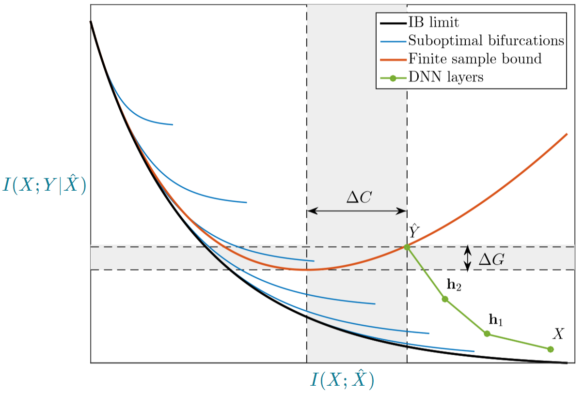].col-5[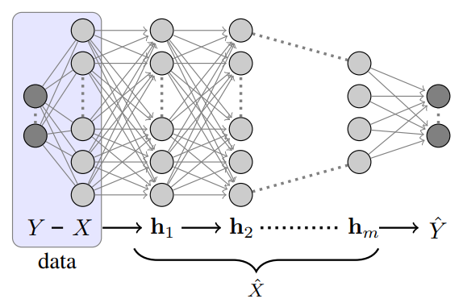]

.font-7[

We can apply the measure of optimality .math[I(\mathbf{h}_{i-1};\mathbf{h}_i) + \beta I(Y;\mathbf{h}_{i-1}|\mathbf{h}_i)] to .ul[not only output layer but also hidden layer] (.math[\mathbf{h}_0 = X] and .math[\mathbf{h}_{m+1} = \hat{Y}]), then we can plot each .green[DNN layer] in the figure above

.alert[Finite sample bound]: because in fact we have only access to a finite sample (don't know true joint distribution .math[p(x,y)]) (bounds of .math[I] proven in [O Shamir et al., 2010]) (...)

.accent[Bifurcations]: correspond to phase transitions between different topological representation of .math[\hat{X}], such as dimensionality change for continuous variables [G Chechik et al., 2005] (...)
]

---

.subtitle[& Deep Learning (2017 paper) - Experiments and Visualization]

.font-7[📄 "Opening the black box of Deep Neural Networks via Information" \cite{2017odnni}]

## Experimental Setup

Fully connected feed-forward neural networks

7 hidden layers: 12-10-7-5-4-3-2 neurons

.ul[Activation function]: hyperbolic tangent (sigmoidal in the final layer)

Trained using .ul[SGD] and cross-entropy loss function, no regularization

.ul[Tasks]: "The tasks were chosen as binary decision rules which are invariant under O(3) rotations of the sphere, with 12 binary inputs that represent 12 uniformly distributed points on a 2D sphere." .opacity06[(I don't understand)]

---

.subtitle[& Deep Learning (2017 paper) - Experiments and Visualization]

.col-6[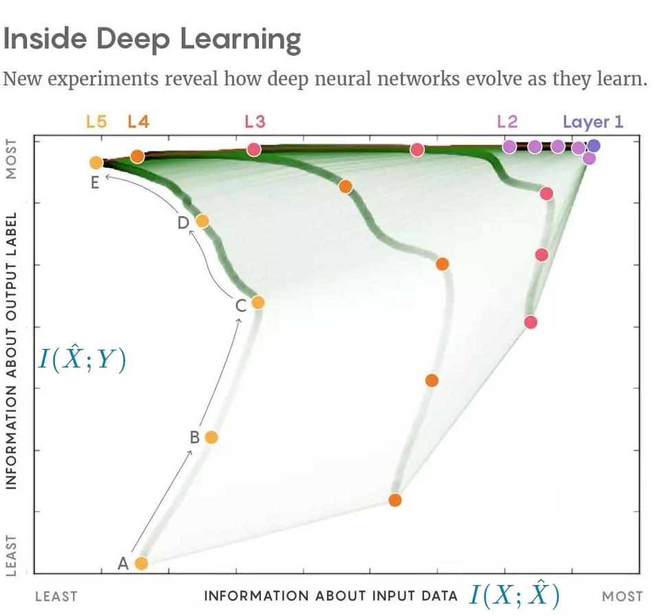].col-6[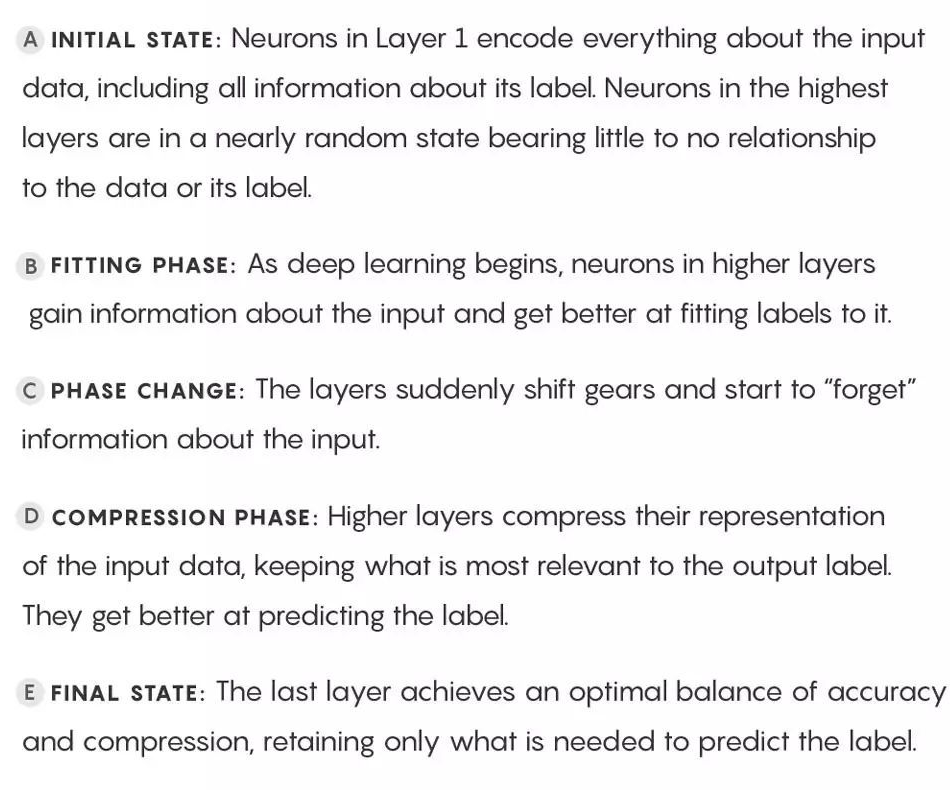]

.font-7[note that .math[y] axis is different from previous page (2015). The effect is vertically flipping the figure]

---

.subtitle[& Deep Learning (2017 paper) - Experiments and Visualization]

## Findings

1. Most training epochs in standard DL are spent on .alert[compression] rather than .alert[fitting].
2. .alert[Compression] phase begins when the training errors becomes small. SGD epochs change .opacity06[from] a .ul[fast drift to smaller training error] .opacity06[into] a .ul[stochastic relaxation], or .ul[random diffusion], constrained by the training error value.
3. The converged layers lie on or very close to the Information Bottleneck (IB) theoretical bound.
4. The main advantage of the hidden layers is computational (because the training time is dramatically reduced when adding more hidden layers)

<!-- 5. As we expect critical slowing down of the stochastic relaxation near phase transitions on the IB curve, we expect the hidden layers to converge to such critical points (???) -->

---

.subtitle[Controversy]

.font-7[📄 "On the Information Bottleneck Theory of Deep Learning", anonymous authors, *under review as a conference paper at ICLR 2018*]

.center.font-7[.green[👍] arguments from IB - .alert[👎] against]

.green[👍] Deep networks undergo two distinct phases consisting of an initial fitting phase and a subsequent compression phase

.alert[👎] For double-sided saturating nonlinearities like tanh .green[✔]; ReLU .red[❌]

.green[👍] Compression phase is causally related to the excellent generalization performance of DNNs

.alert[👎] No evident causal connection between compression and generalization

.green[👍] Compression phase occurs due to the diffusion-like behavior of SGD

.alert[👎] Full batch GD can also replicate it

---

class: subtitle
layout: false

# LIME

.subtitle[Local Interpretable Model-agnostic Explanations]

.font-7[📄 "Why Should I Trust You? Explaining the Predictions of Any Classifier", *KDD*, \cite{2016wsity}]

An .ul[explanation technique] that explains the predictions of *any* classifier in an interpretable and faithful manner, by locally fitting a simpler model (e.g. linear model) around the test point

.col-5[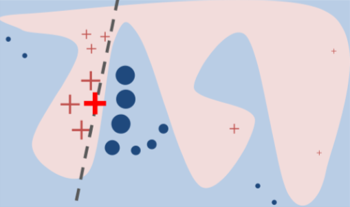].col-7[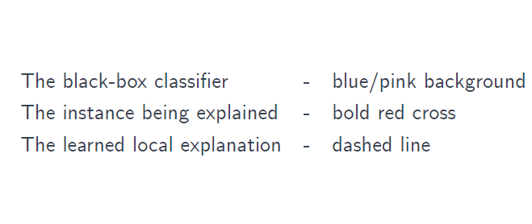]

---

# Other Explanation Techniques

.font-7[📄 "A Unified Approach to Interpreting Model Predictions", *NIPS*, \cite{2017auaimp}]

 

.center.col-11[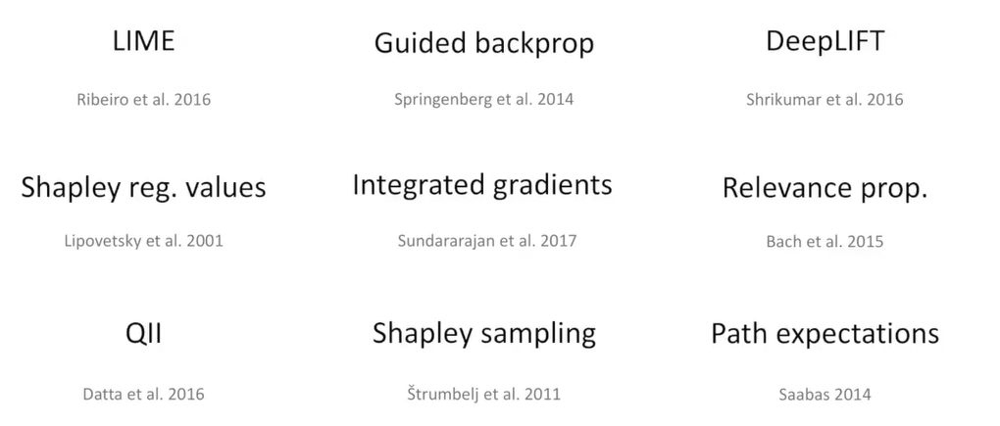]

.center[......]

<!-- ---

## ANOVA \cite{2004dasbbf}

## ? Layer-wised analysis with Gaussian kernels \cite{2010ladn} -->

---

# Connectionist vs. Symbolic Approaches

.opacity06.font-7[(Prof. Xin Yao's suggestion)]

Understanding neural networks via .ul[rule extraction] (some work in the 90s, Huan Liu) \cite{1995unnre}

Three steps:

1. Network training
2. Network pruning
3. Rule extraction  
   (in the form of "if .math[(x_1\theta c_1)] and .math[(x_2\theta c_2)] and .math[\ldots] then .math[C_j]", where  
   .math[x_i] is an attribute of the input tuple,  
   .math[\theta] is relational operator (.math[=,\le,\ge,\lt\gt]),  
   .math[C_j] is one of the class labels)

---

# SOSP Paper

.font-7[📄 "DeepXplore: Automated Whitebox Testing of Deep Learning Systems", *SOSP*, \cite{2017dawt}]

.dl[
**Problem**: Existing .alert[testing] schemes for DL systems have many limitations. (usually using test set randomly split from all data)
- Expensive labeling effort
- .alert[\*] Low test coverage (often fails to cover important corner cases)
]

.dl[
**Aim**: Automatically find inputs that trigger erroneous behaviors in DL systems .opacity06[(and prove these inputs can be used to fix the buggy behavior)]
]

**Code coverage**: a measure used to describe the degree to which the source code of a program is executed when a particular test suite runs (e.g. .ul[the percentage of program statements called during testing])

<!-- Traditional software, developers directly specify the logic of the system

DNN, learn rules automatically from data -->

---

# SOSP Paper

.dl[
**Method**: We have multiple DNNs to test (both perform similar tasks)

takes unlabeled test inputs as seeds and generates new tests that
1. cover a large number of neurons (maximize .alert[neuron coverage])
2. cause the tested DNNs to behave differently
]

.col-1-empty[].col-3[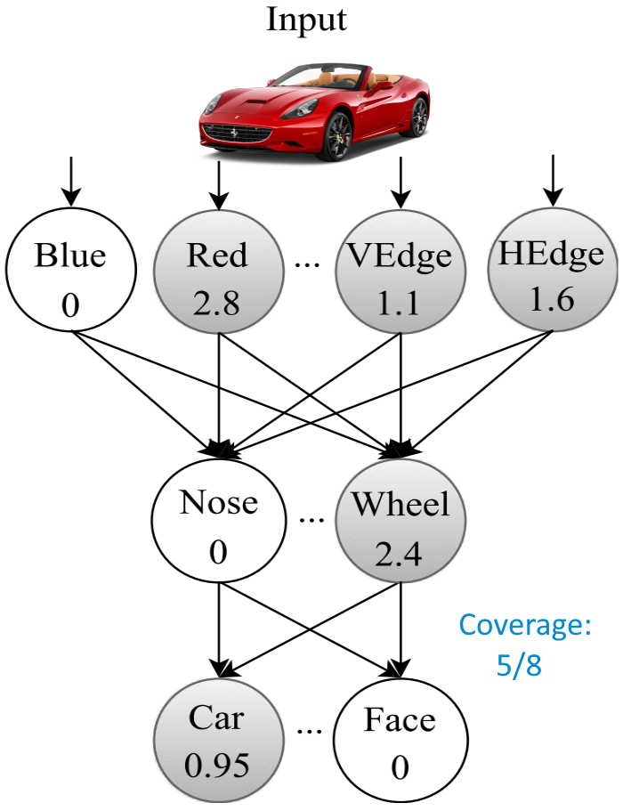].col-1-empty[].col-6[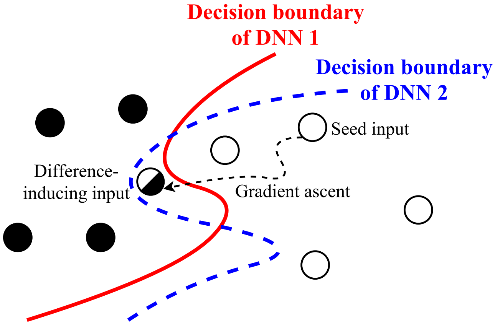]
.col-2-empty[].col-3.font-7[neuron coverage].col-3-empty[].col-3.font-7[behave differently]

---

# Explainable Artificial Intelligence (XAI)

A DARPA program

## Related work (summarized by XAI)

1) Force model to learn explainable features/generate explanation

.col-6[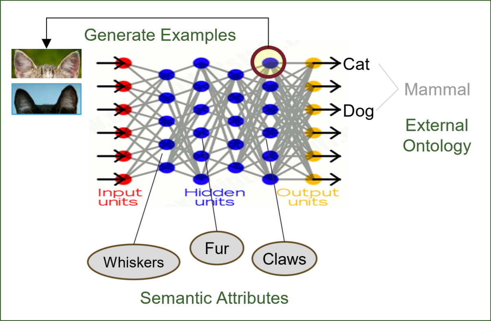].col-6[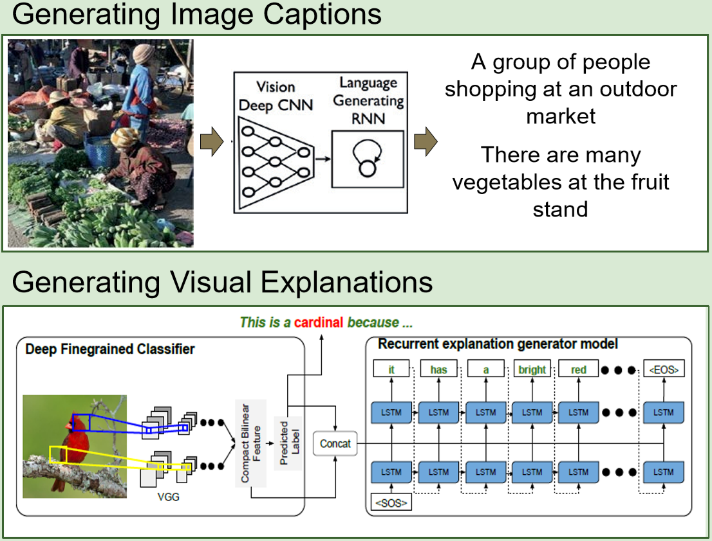]

.font-7[**Right**: A CNN is trained to recognize objects in images. A language generating RNN is trained to translate features of the CNN into words and captions]

---

class: subtitle

# Explainable Artificial Intelligence (XAI)

.subtitle[Related Work]

2) Interpretable models (not DNNs)

- .font-7[📄 "Human-level concept learning through .ul[probabilistic program induction]", *Science* (cognitive science)]
- .font-7[📄 "Learning .ul[AND-OR Templates] for Object Recognition and Detection", *TPAMI*, \cite{2013laot}]

3) Model induction (.alert[infer] an explainable model from black-box)

- LIME
- .font-7[📄 "Interpretable classifiers using rules and Bayesian analysis"  ]
  .font-7[a generative model called .ul[Bayesian Rule Lists]]

.center.col-8[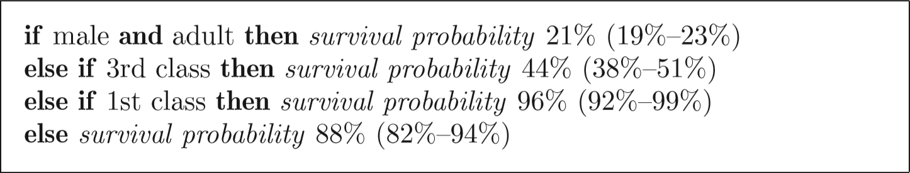]

---

# Network Dissection

.font-7[📄 "Quantifying Interpretability of Deep Visual Representations", *CVPR*, \cite{2017ndqi}]

.dl[
Propose a general framework called *Network Dissection*  
.opacity06[for] .ul[quantifying the interpretability of latent representations] of CNNs  
.opacity06[by] evaluating the alignment  
.opacity06[between] individual hidden units .opacity06[and] a set of semantic concepts
]

.dl[
**Dataset**: Densely labeled dataset (pixel-wise annotation)  
.center.col-8[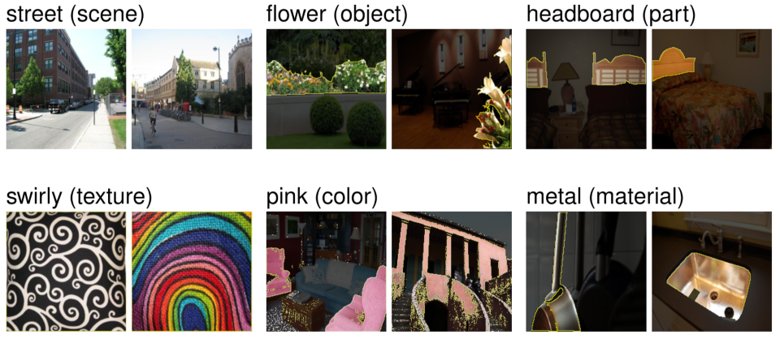].font-7[Examples are segmented down to the pixel level. (e.g. A pixel might have label 'cat leg black')]
]

---

# Network Dissection

.dl[
**Method**: Input image .math[\mathbf{x}] and a certain convolutional unit .math[k]

The activation map .math[A_k(\mathbf{x})]

Scaled up to .math[S_k(\mathbf{x})] (to have the same resolution with .math[\mathbf{x}])

Thresholded into a binary segmentation .math[M_k(\mathbf{x})\equiv S_k(\mathbf{x}) \ge {\rm Threshold}]

For a concept .math[c], we already have input-resolution annotation mask .math[L_c(\mathbf{x})] from dataset  
(concept is one of {object, part, scene, texture, material, color})

The score of each unit .math[k] as segmentation for concept .math[c] is

.center.math.block[IoU_{k,c} = \frac{\sum|M_k(\mathbf{x}) \cap L_c(\mathbf{x})|}{\sum|M_k(\mathbf{x}) \cup L_c(\mathbf{x})|}]

.math[|\cdot|] is the cardinality of a set
]

---

# Network Dissection

.dl[
**Experiments**: ...
]

.dl[
**Conclusion**: We applied *network dissection* to
- measure whether interpretability is an axis-independent phenomenon, and we found that it is not
- investigate the effects on interpretability of state-of-the-art CNN training techniques

We have confirmed that representations at different layers disentangle different categories of meaning (find .ul[lower-level concepts at lower layers], .ul[higher-level concepts at high layers])

and that different training techniques can have a significant effect on the interpretability of the representation learned by hidden units
]

.opacity06[(I don't think the calculated value is equal to interpretability...)]

---

# Interpretable CNNs

.font-7[📄 "Interpretable CNNs" \cite{2017icnn} .opacity06[(An over-claiming title 😑)]]

.dl[
**Problem**: In traditional CNNs, a high-layer filter may .alert[represent a mixture of patterns]
]

.dl[
**Aim**: Train each filter in a high conv-layer to .alert[clearly represent an object part]
]

.dl[
**Method**: Add a .alert[local loss] for the output feature map of .alert[each filter] (which encourages a low entropy of inter-category activations and a low entropy of spatial distributions of neural activations)
]

.col-6[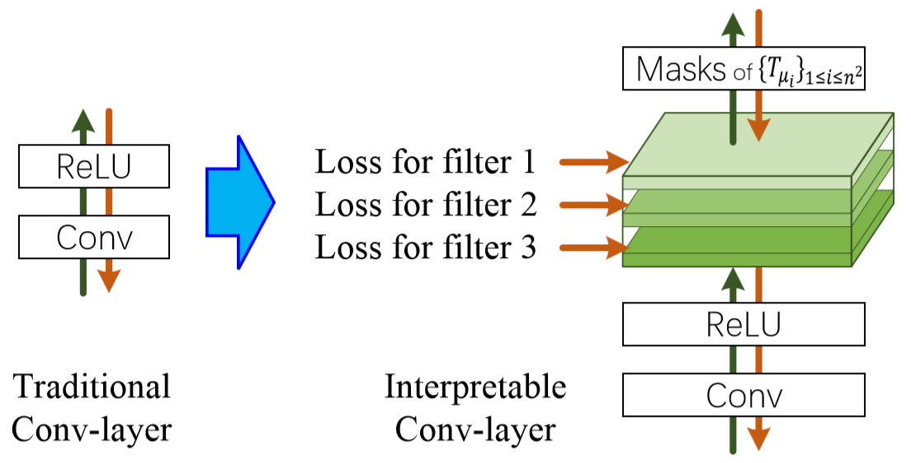] .opacity06[(didn't understand the details)]

---

# Visualizing and Understanding CNNs

- Visualize activations
- Deconvolutional networks (projecting the feature activations back to the input pixel space) \cite{2014vucn}
- Retrieving images that maximally activate a neuron
- Generate CNN's preferred image \cite{2016spi}
- Saliency maps
- t-SNE; ...

.opacity06[
"Feature visualization is a promising technique to make neural networks interpretable. But by itself, feature visualization can never give a completely satisfactory understanding.

We see it as one of the fundamental building blocks that, combined with additional tools, will empower humans to understand these systems (DNNs)."
]

---

class: subtitle
layout: true

# Theories of Deep Learning?

---

class: local-1

.subtitle[Stanford, STATS 385, Fall 2017]

.opacity06.font-7[<a href="https://stats385.github.io/" target="_blank">Website</a> <i class="fa fa-external-link" style="font-size: .5em;"></i>]

"What is a Theory? Models that explain and that predict."

## Relevant theoretical approaches

| Field                | Example                                                                                                                              |
| :------------------: | :----------------------------------------------------------------------------------------------------------------------------------: |
| Neuroscience         | Bruno Olshausen                                                                                                                      |
| Harmonic Analysis    | Joan Bruna and Stephane Mallat Helmut Boelcskei and co-authors Vardan Papyan, Jeremias Sulam, Yaniv Romano and Michael Elad |
| Approximation Theory | Tomaso Poggio and Hrushikesh Mhaskar                                                                                                 |
| Statistics           | Zaid Harchaoui                                                                                                                       |
| Information Theory   | Naftali Tishby                                                                                                                       |

---

.subtitle[Lecture 3 - .alert[Harmonic Analysis] of Deep CNNs - Invariant Scattering CNNs]

.font-7[📄 "Invariant Scattering Convolutional Networks", *TPAMI*, \cite{2013iscn}]

.dl[
**Problem**: A major difficulty of image classification comes from the considerable .alert[variability within image classes] .opacity06[and] the inability of Euclidean distances to measure image similarities
]

Two kinds of variability:

1. rigid translations, rotations, or scaling .font-7[(uninformative, should be eliminated)]
2. non-rigid deformations .font-7[(allow small deformations)]

.col-7[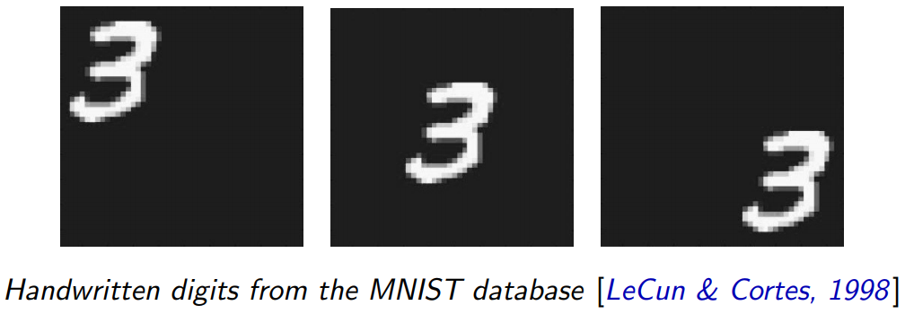].col-5[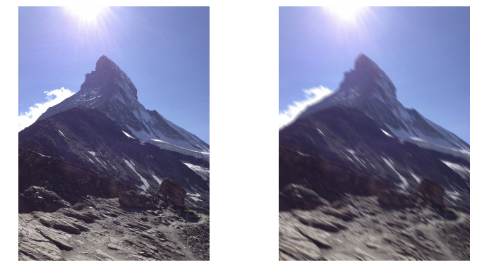]

---

class: local-1

.subtitle[Lecture 3 - Harmonic Analysis of Deep CNNs - Invariant Scattering CNNs]

Given signal .math[x]

<table>
<tbody>
<tr><td>Registration algorithms, Autocorrelations, Fourier transform modulus, ...</td><td>invariant to <i>translations</i>, but not stable to <i>deformations</i></td></tr>
<tr><td>Wavelet transforms</td><td>covariant to <i>translations</i></td></tr>
<tbody>
</table>

It seems that deep CNNs can build large-scale invariants which are stable to deformations. .opacity06[But] the .ul[properties and optimal configurations] of these networks are not well understood.

.dl[
**Questions**: Why use multiple layers? How many layers? How do we optimize filters and pooling nonlinearities? How many internal and output neurons? ...
]

---

.subtitle[Lecture 3 - Harmonic Analysis of Deep CNNs - Invariant Scattering CNNs]

In this paper, concentrate on a particular class of deep CNNs, defined by the **scattering transforms**.

A **scattering transform** computes a translation invariant representation .opacity06[by] .ul[cascading wavelet transforms and modulus pooling operators], which average the amplitude of iterated wavelet coefficients.

(... ???). Finally proved translation invariance and deformation stability

.divider[]

.font-7[📄 T Wiatowski, H Bölcskei, .ul[A Mathematical Theory of Deep Convolutional Neural Networks for Feature Extraction], *arXiv*, 2015. (<a href="https://arxiv.org/abs/1512.06293" target="_blank">link</a> <i class="fa fa-external-link" style="font-size: .5em;"></i>)]

.font-7.margin-bottom-0[
"This paper .alert[complements Mallat's results] by developing a theory that .alert[encompasses general convolutional transforms], or in more technical parlance, general semi-discrete frames (including Weyl-Heisenberg filters, curvelets, shearlets, ridgelets, wavelets, and learned filters), general Lipschitz-continuous non-linearities (e.g., rectified linear units, shifted logistic sigmoids, hyperbolic tangents, and modulus functions), and general Lipschitz-continuous pooling operators emulating, e.g., sub-sampling and averaging."
]

---

.subtitle[Lecture 4, CNNs from First Principles: Generative Models, Dynamic Programming & EM]

.font-7[📄 "A Probabilistic Framework for Deep Learning", *NIPS*, \cite{2016apfdl}]

❓❓❓

.margin-bottom-0[
.center.col-10[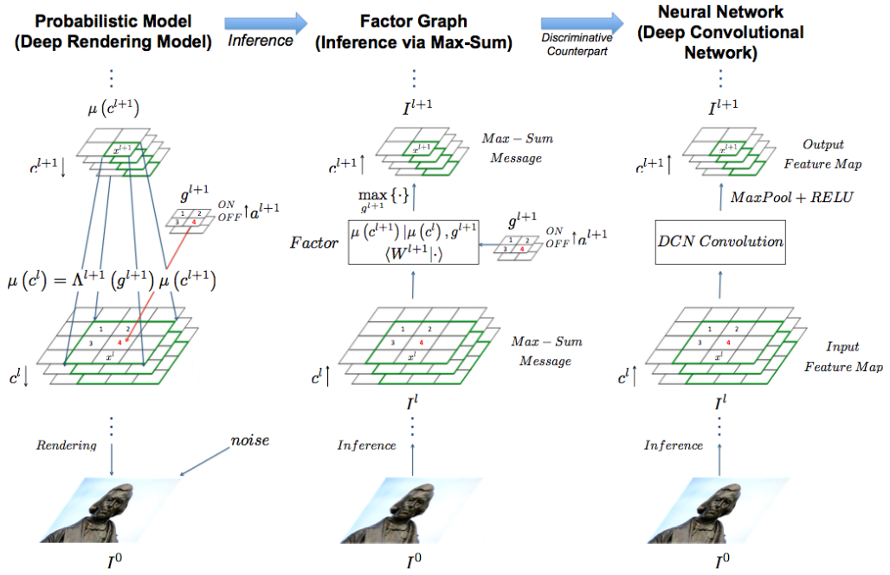]
]

---

.subtitle[Lecture 5, Deep Networks: Theoretical Puzzles]

.font-7[Guest speaker: Tomaso Poggio (MIT, Center for Brains, Minds and Machines)]

.dl[
**Three Theory Questions**:

1. .accent[Approximation Theory]: When and why are deep networks better than shallow networks?
2. .accent[Optimization]: What is the landscape of the empirical risk?
3. .accent[Learning Theory]: How can deep learning not overfit?
]

.accent[1.] Briefly, for one-layer (shallow) network (e.g. .math[y = f(x_1, x_2, ..., x_d)]), we need .math[\mathcal{O}(\varepsilon^{-d})] parameters to well approximate it. (exponentially)
 .font-7.opacity06[.math[\varepsilon] - approximation error; .math[d] - #input variables]

For a hierarchically, locally, compositional function
 .center.math[g_3(g_{21}(x_1,x_2),g_{12}(x_3,x_4))g_{22}(g_{11}(x_5,x_6),g_{12}(x_7,x_8)))]
(binary tree structure in this case), we need .math[\mathcal{O}(d\varepsilon^{-2})] parameters
 .font-7.opacity06[.math[2] - local dimensionality, of course can be other numbers]

---

.subtitle[Lecture 5, Deep Networks: Theoretical Puzzles]

.opacity06[Really perfunctory slides and lecture by Tomaso Poggio ...]

.dl[
**Summary**:

1. For hierarchical compositional functions deep but not shallow networks avoid the curse of dimensionality because of .ul[locality of constituent functions]
2. Bezout theorem suggests .ul[many global minima] that are found by SGD with high probability w.r.t. local minima
3. Unlike the case for a linear network the data dictate - .ul[because of the regularizing dynamics of GD] - the number of effective parameters, which are in general fewer than the number of weights
]

---

class: no-change

.subtitle[Lecture 6, Views of Deep Networks from RKHS]

.font-7[📄 "Convolutional Kernel Networks", *NIPS*, \cite{2014ckn}]

.dl[
**An important goal in visual recognition**: is to devise image representations that are invariant to particular transformations
]

---

.subtitle[Lecture 7, Understanding and Improving Deep Learning With .alert[Random Matrix Theory]]

## Motivation

.dl[
**Why random matrices?**

- Randomly initialized weight matrices
  - In deep learning context, training may induce only low-rank perturbations around the random configuration.
- Looking at every parameter might be intractable and uninformative
- Useful quantities to matrix structure
  - E.g. eigenvalues and eigenvectors
]

.dl[
**Which matrices to care about?**

Activations; Hessians (loss w.r.t. weights); Jacobians
]

❓

---

.subtitle[Lecture 9, What's Missing from Deep Learning? - .alert[Neuroscience] view (Bruno Olshausen)]

.dl[
**Pooling**  
.accent[Pro] Get *invariant features*  
.accent[Con] Lose information about *relative spatial relationship*
]

The price you pay for pooling: You get invariance but get too much

.col-5[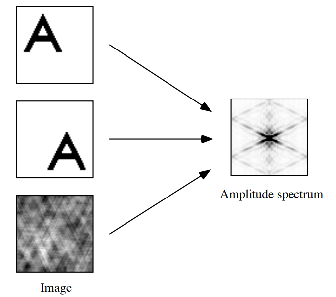].col-1-empty[].col-5[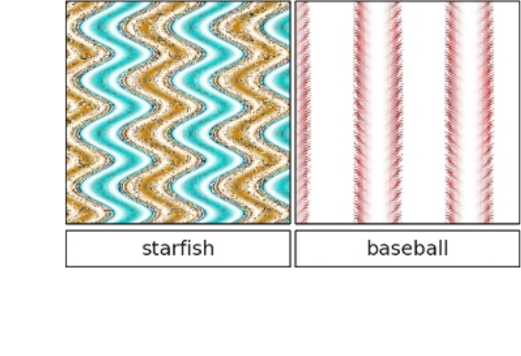]
 .caption[looks the same after Fourier transformation].col-3-empty[].caption[DNNs are easily fooled]

---

.subtitle[Lecture 9, .alert[What's Missing] from Deep Learning? - Neuroscience view]

Lots of ingredients (in neuroscience) we want to bring into current model to make it computationally richer or maybe more expressive

Computing a weighted sum of inputs and putting it through a non-linearity (since the later 1950s) → not a good model of how neurons actually work as we know a lot more now. (Maybe .math[\Sigma\Pi] model?)

**Two specific proposals**: .accent[1)] Dynamic routing .accent[2)] Hierarchical Bayesian inference

.accent[Dynamic routing] try to get around pooling (something like *Capsule* that Hinton recently talked about)

.col-12[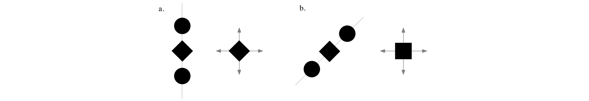]

---

.subtitle[Lecture 9, .alert[What's Missing] from Deep Learning? - Neuroscience view]

.accent[Hierarchical Bayesian inference]

Perception is *inference* problem (rather than *classification* problem)

.col-6[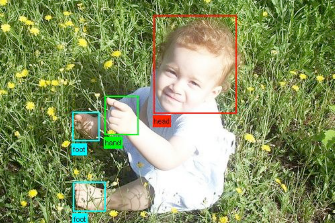] .col-5[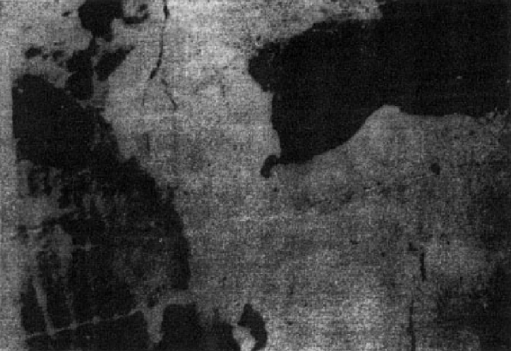]

---

.font-7[
<!-- 4: CNNs from First Principles: Generative Models, Dynamic Programming & EM (Ankit Patel). .no-linebreak.opacity06[[slides](https://stats385.github.io/assets/lectures/2017%20Stanford%20Guest%20Lecture%20-%20Stats%20385%20-%20Oct%202017.pdf) <i class="fa fa-external-link" style="font-size: .5em;"></i>]

.divider[]

5: When Can Deep Networks Avoid the Curse of Dimensionality and Other Theoretical Puzzles (Tomaso Poggio). .no-linebreak.opacity06[[slides](https://stats385.github.io/assets/lectures/StanfordStats385-20171025-Lecture05-Poggio.pdf) <i class="fa fa-external-link" style="font-size: .5em;"></i>]

.divider[]

6: Views of Deep Networks from .alert[Reproducing Kernel Hilbert Spaces] (Zaid Harchaoui). .no-linebreak.opacity06[[slides](https://stats385.github.io/assets/lectures/lecture6_stats385_stanford_nov17.pdf) <i class="fa fa-external-link" style="font-size: .5em;"></i>]

📄 J. Mairal, P. Koniusz, Z. Harchaoui and C. Schmid, .ul[Convolutional Kernel Networks], *NIPS*, 2014.

.divider[] -->

8: Topology and Geometry of Half-Rectified Network Optimization (Joan Bruna). .no-linebreak.opacity06[[slides](https://stats385.github.io/assets/lectures/stanford_nov15.pdf) <i class="fa fa-external-link" style="font-size: .5em;"></i>]

10: Convolutional Neural Networks in View of Sparse Coding (Vardan Papyan)
]

---

class: subtitle
layout: false

# Others

.subtitle[Listed for Information]

- Learn to generate textual explanations at the same time \cite{2016gve}
- Convergent learning (whether different networks learn similar features) \cite{2015cl}

---

class: no-number
count: false
layout: true

# References

---

count: false

@{1980ceif}{R. Dennis Cook, Sanford Weisberg}{Characterizations of an Empirical Influence Function for Detecting Influential Cases in Regression}{Technometrics}{1980}
@{1982rir}{R. Dennis Cook, Sanford Weisberg}{Residuals and influence in regression}{New York: Chapman and Hall}{1982}
@{1995unnre}{Rudy Setiono, Huan Liu}{Understanding neural networks via rule extraction}{IJCAI}{1995}
@{2000ibm}{Naftali Tishby, Fernando C. Pereira, and William Bialek}{The information bottleneck method}{arXiv}{2000}
@{2011adn}{Matthew D. Zeiler, Graham W. Taylor and Rob Fergus}{Adaptive Deconvolutional Networks for Mid and High Level Feature Learning dae4eed}{ICCV}{2011}
@{2013iscn}{Joan Bruna, Stephane Mallat}{Invariant Scattering Convolution Networks}{TPAMI}{2013}
@{2013laot}{Zhangzhang Si and Song-Chun Zhu}{Learning AND-OR Templates for Object Recognition and Detection}{TPAMI}{2013}
@{2014ckn}{Julien Mairal, Piotr Koniusz, Zaid Harchaoui, and Cordelia Schmid}{Convolutional Kernel Networks}{NIPS}{2014}
@{2014vucn}{Matthew D. Zeiler, Rob Fergus}{Visualizing and Understanding Convolutional Networks}{ECCV}{2014}

---

count: false

@{2015cl}{Yixuan Li, Jason Yosinski, Jeff Clune, Hod Lipson, John Hopcroft}{Convergent Learning: Do different neural networks learn the same representations?}{Feature Extraction: Modern Questions and Challenges}{2015}
@{2015dlibp}{Naftali Tishby, Noga Zaslavsky}{Deep Learning and the Information Bottleneck Principle}{Information Theory Workshop}{2015}
@{2016apfdl}{Ankit B. Patel, Tan Nguyen, Richard G. Baraniuk}{A Probabilistic Framework for Deep Learning}{NIPS}{2016}
@{2016gve}{Lisa Anne Hendricks, Zeynep Akata, Marcus Rohrbach, Jeff Donahue, Bernt Schiele and Trevor Darrell}{Generating Visual Explanations}{ECCV}{2016}
@{2016spi}{Anh Nguyen, Alexey Dosovitskiy, Jason Yosinski, Thomas Brox and Jeff Clune}{Synthesizing the preferred inputs for neurons in neural networks via deep generator networks}{NIPS}{2016}
@{2016wsity}{Marco Tulio Ribeiro, Sameer Singh, Carlos Guestrin}{“Why Should I Trust You?” Explaining the Predictions of Any Classifier}{KDD}{2016}
@{2017auaimp}{Scott M. Lundberg, Su-In Lee}{A Unified Approach to Interpreting Model Predictions}{NIPS}{2017}

---

count: false

@{2017dawt}{Kexin Pei, Yinzhi Cao, Junfeng Yang, Suman Jana}{DeepXplore: Automated Whitebox Testing of Deep Learning Systems}{SOSP}{2017}
@{2017icnn}{Quanshi Zhang, Ying Nian Wu, and Song-Chun Zhu}{Interpretable Convolutional Neural Networks}{arXiv}{2017}
@{2017iml}{Been Kim}{Interpretable Machine Learning: The fuss, the concrete and the questions}{ICML Tutorial}{2017}
@{2017ndqi}{David Bau, Bolei Zhou, Aditya Khosla, Aude Oliva, Antonio Torralba}{Network Dissection: Quantifying Interpretability of Deep Visual Representations}{CVPR}{2017}
@{2017odnni}{Ravid Schwartz-Ziv, Naftali Tishby}{Opening the black box of Deep Neural Networks via Information}{arXiv}{2017}
@{2017ubpif}{Pang Wei Koh, Percy Liang}{Understanding Black-box Predications via Influence Functions}{ICML}{2017}