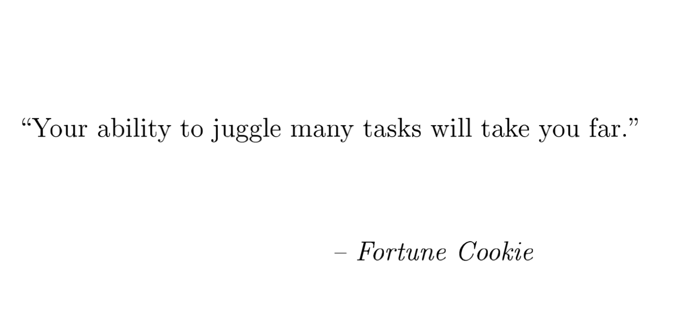

class: center, middle, no-number, titlepage
count: false

# Multi-task Learning for Aspect-level Sentiment Analysis

.author[Wen Weihuang]

.date[April 10, 2018]

---

# Outline

- What is aspect-level sentiment analysis
    - Sentiment analysis
    - Aspect-level sentiment analysis
- What is multi-task learning
- Why multi-task learning
- Recent Work
- Model description
- Experiments and analysis
- Conclusion and future work

---

# What is aspect-level sentiment analysis

- Sentiment analysis
- Aspect-level sentiment analysis

---

## Sentiment analysis

.font-7[📄 "Deep Learning for Sentiment Analysis: A Survey", Lei Zhang, Shuai Wang, Bing Liu, *arxiv.org*]

<q>Sentiment analysis or opinion mining is the computational study of people's opinions, sentiments, emotions, appraisals and attitudes towrads entities such as products, services, organizations, individuals, issues, events, topics, and their attributes.</q>

<q>Since early 2000, sentiment analysis has grown to be one of the most active research areas in natural language processing (NLP). It is also widely studied in data mining, Web mining, text mining, and information retrieval. </q>

Researchers have mainly studied sentiment analysis at three levels of granularity:
- document level
- sentence level
- .alert[**aspect level**]

---

## Aspect-level sentiment analysis

<q>Compared with document level and sentence level sentiment analysis, aspect level sentiment analysis or aspect-based sentiment analysis is more fine-grained. Its task is to extract and summarize people's opinions expressed on entities and aspects/features of entities, which are also called targets.</q>

<q>For example, in a product review, it aims to summarize positive and negative opinions on different aspects of the product respectively, although the general sentiment on the product could be positive or negative. The whole task of aspect-based sentiment analysis consists of several subtasks such as .alert[**aspect extraction**], .alert[**entity extraction**] and .alert[**aspect sentiment classification**].</q>

---
.subtitle[Aspect-level sentiment analysis]

.dl[**Demo**: "the voice quality of iPhone is great, but its battery sucks".

- entity extraction:
    -  "iPhone"
- aspect extraction:
    -  "voice quality"
    -  "battery"
- aspect sentiment classification: 
    - "voice quality": 👍
    - "battery": 👎
]

---

# What is multi-task learning (MTL)

.font-7[📄 "An overview of multi-task learning", Yu Zhang, Qiang Yang, *National Science Review 2018*]

<q>As a promising area in machine learning, MTL aims to leverage useful information contained in multiple learning tasks to help learn a more accurate learner for each task. **Based on an assumption that all the task, or at least a subset of them, are related, jointly learning multiple tasks is empirically and theoretically found to lead to better performance than learning them independently.**</q>

<q>MTL can be viewed as one way for machines to mimic human learning activities since people often transfer knowledge from one task to another and vice versa when tese tasks are related. **One example from our own experience is that the skills for playing squash and tennis can help improve each other**.</q>

<q>MTL is related to other areas in machine learning, including transfer learning, multi-label learning and multi-output regression, but exhibits different characteristics.</q>

---

# What is multi-task learning (MTL)

<q>As a promising learning paradigm, MTL has been applied to several areas, including computer vision, bioinformatics, health informatics, speech, .alert[natural language processing], web applications and ubiquitous computing, and several representative applications in each area are presented.</q>

.dl[**Definition**: (Multi-task learning) Given m lerning tasks .math[{\lbrace T_i \rbrace}_{i=1}^{m}] where all the tasks or a subset of them are related but not identical, multi-task learning aims to help improve the learning of a model for .math[T_i] by using the knowledge contained in the *m* tasks.
]

Two elementary factors for MTL:
- the definition of task
- the task relatedness

---

# What is multi-task learning (MTL)

.dl[**Several setting of MTL**:
- .alert[multi-task supervised learning (MTSL)]
- multi-task unsupervised learning
- multi-task semi-supervised learning
- multi-task active learning
- multi-task reinforcement learning
- multi-task online learning
- multi-task multi-view learning
]

---

# Why multi-task learning

.font-7[📄 "Multitask Learning", Rich Caruana, 1997]

<!-- .col-4[].col-4[] -->

  

    
  

  

    
  

- Multi-task learning can improves learning for one task by using the information contained in training signals of other related tasks.
- The training data of ABSA is extremely sparse, by jointly learning correlated tasks, the amount of usable data increases.

---

# Recent work

- Word embedding
    - Word2Vec
        - Continuous Bag-of-Words
        - Skip-Gram
    - Global Vector
- Recurrent neural network (RNN)
    - Long short-term memory network (LSTM)
    - Gated Recurrent Unit (GRU)
    - Bidirectional RNN

---

# Recent work

- Attention mechanism with recurrent neural network
- Memory network

---

# Model description

\begin{bmatrix}
a  \\
b
\end{bmatrix}

---

# Experiments and analysis

---

## Dataset description

SemEval aspect-based sentiment analysis (ABSA) challenge:
- SemEval Challenge 2014 task 4
    - Domain: ***laptop***
    - Size: ***3595***
- SemEval Challenge 2015 task 12
    - Domain: ***restaurant***
    - Size: ***2000***
- SemEval Challenge 2016 task 5
    - Domain: ***restaurant***
    - Size: ***2676***

---

# Conclusion and future work

Todo
